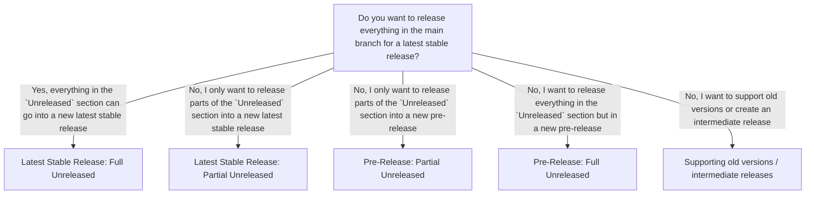

# Release Process for packages

This document describes the release process for packages.

Requirement / Goals:

- have a changelog (to document changes, especially breaking changes)
- automate as much as possible
- keep it simple as possible so anyone can do it
- respect branch protection rules
- have a consistent release process for all packages
- follow semantic versioning

## Tools

To achieve the requirements we use the following tools:

- [semantic versioning](https://semver.org/)
- [keep-a-changelog](https://keepachangelog.com/)
- [release-it](https://github.com/release-it/release-it)
- [release-it/keep-a-changelog](https://github.com/release-it/keep-a-changelog)

## GitHub Actions

To release a new version of a package we use a single GitHub action that is triggered by a manual workflow dispatch.
It will have two inputs:

- version: major, minor, patch
- release-type: stable, rc, alpha, beta, increment-prerelease

This ensures that we can release a new version of a package with a single click.

## How to use it

### Initial release

The initial release should be `0.1.0` according to semantic versioning.
To achieve this we will set the version in the package.json to `0.0.0` and do a minor release. As soon as the package is used in production a major release will set the version to `1.0.0`.
The initial changelog should look like this:

```
# Changelog

All notable changes to this project will be documented in this file.

The format is based on [Keep a Changelog](https://keepachangelog.com/en/1.0.0/),
and this project adheres to [Semantic Versioning](https://semver.org/spec/v2.0.0.html).

## [Unreleased]

### Added

- initial release :tada:
```

Also make sure that the `strictLatest` option is set to `false` in the release-it config. After the first release is done, set it to `true`.

### Decision Tree for Releasing

Important points to remember for the whole release process:


- The process explained can be a bit overwhelming at first, but we want to ensure that we can release what we want, when we want, and that the code is in a releasable state. 
The most common case is to release everything in the `Unreleased` section as a latest stable release, which is the easiest one.

- :warning: **We never release from a feature branch!**
Always release from the `main` branch or a dedicated `release/x.x.x` / `pre-release/x.x.x` branch.
That means you should merge whatever you want to release into the `main` branch first, from there you can follow the descision tree below.

- :warning: **There is a branch protection rule for `release/*` and `pre-release/*` so those branches cannot be deleted.**

- :warning: **We only want the package.json version and changelog to be updated for latest stable releases.**




### Latest Stable Release: Full Unreleased

This is the most common case where you want to release everything in the `Unreleased` section as a latest stable release. And it's also the easiest one:

- Run the GitHub action with major, minor or patch and stable as release-type from the **main** branch.

- The GitHub action will automatically update the `package.json` version, create a new tag, update the `CHANGELOG.md` file and push everything into the `main` branch.

### Latest Stable Release: Partial Unreleased

This is the case where you want to release only parts of the `Unreleased` section as a latest stable release. This is useful if you have multiple features or fixes in the `Unreleased` section but only want to release some of them. This is useful for example if there is an ongoing pre release but you need to release a crucial bug fix or security fix.

- Create a new branch from the tag of the last latest stable release (e.g. `1.2.3`) and name it accordingly (e.g. you want to create a patch release for `1.2.3`, so name it `release/1.2.4`).
  `git checkout -b release/1.2.4 1.2.3`

- Cherry-pick the squash commits you want to release from the `main` branch into your `release/1.2.4` branch. You can use `git cherry-pick <commit-hash>` for this.

- Run the GitHub action with major, minor or patch and stable as release-type from the `release/1.2.4` branch you created **(not the main branch)**.

- The GitHub action will automatically update the `package.json` version, create a new tag, update the `CHANGELOG.md` file and push everything into the `release/1.2.4` branch.

- After the release is done, the GitHub action will merge the `release/1.2.4` branch into the `main` branch.
    - This should only update the `CHANGELOG.md` file and the `package.json` version, not the code itself.
    - Since this is the new latest latest stable release, it's safe to merge it into the `main` branch.

### Pre-Release: Partial Unreleased

This is the case where you want to release only parts of the `Unreleased` section as a pre-release. This is useful if you have multiple features or fixes in the `Unreleased` section but only want to release some of them as a pre-release.

- Create a new branch from the tag of the last latest stable release (e.g. `1.2.3`) and name it accordingly (e.g. you want to create an alpha patch release for `1.2.3`, so name it `pre-release/1.2.4-alpha.0`).
  `git checkout -b pre-release/1.2.4-alpha.0 1.2.3`

- Cherry-pick the squash commits you want to release from the `main` branch into your `pre-release/1.2.4-alpha.0` branch. You can use `git cherry-pick <commit-hash>` for this.

- Run the GitHub action with major, minor or patch and rc, alpha or beta as release-type from the `pre-release/1.2.4-alpha.0` branch you created **(not the main branch)**.

- Once you are done with the pre-release, continue with the stables release process as described above—either [Latest Stable Release: Full Unreleased](#stable-release-full-unreleased) or [Latest Stable Release: Partial Unreleased](#stable-release-partial-unreleased).

- :warning: **Do not add anything manually to the `pre-release/1.2.4-alpha.0` branch, only cherry-pick squash commits from the `main` branch. This will ensure that the code was checked by our CI pipeline and is in a releasable state. If you want to make changes, create a PR into main. This will ensure that the code was checked by our CI pipeline and is in a releasable state. If you want to make changes, create a PR into main and then restart the process from there.**

todo: how will the version increment work for pre-releases?

### Pre-Release: Full Unreleased

This is the case where you want to release everything in the `Unreleased` section as a pre-release. This is useful if you have multiple features or fixes in the `Unreleased` section and want to test them before releasing them as a latest stable release.

- Create a new branch from the main branch and name it accordingly (e.g. `pre-release/1.2.4-beta.0`).
  `git checkout -b pre-release/1.2.4-beta.0 main`

- Run the GitHub action with major, minor or patch and rc, alpha or beta as release-type from the `pre-release/1.2.4-beta.0` branch you created **(not the main branch)**.

- Once you are done with the pre-release, continue with the stables release process as described above—either [Latest Stable Release: Full Unreleased](#stable-release-full-unreleased) or [Latest Stable Release: Partial Unreleased](#stable-release-partial-unreleased).

- :warning: **Do not add anything manually to the `pre-release/1.2.4-beta.0` branch, only cherry-pick squash commits from the `main` branch. This will ensure that the code was checked by our CI pipeline and is in a releasable state. If you want to make changes, create a PR into `main`. This will ensure that the code was checked by our CI pipeline and is in a releasable state. If you want to make changes, create a PR into `main` and then restart the process from there.**

### Supporting old versions / intermediate releases

This is the case where you want to support old versions of a package or create an intermediate release. Let's assume your package is at version 2.3.4 and you want to create a patch release for version 1.2.3, so the users of major version 1 can get a crucial bug fix or security fix. But you don't want to force them to update to major version 2.

- Create a new branch from the tag of the previous stable release (e.g. `1.2.3`) and name it accordingly (e.g. you want to create a patch release for `1.2.3`, so name it `release/1.2.4`).
  `git checkout -b release/1.2.4 1.2.3`

- Either cherry-pick the squash commits you want to release from the `main` branch into your `release/1.2.4` branch or create a new PR into the `release/1.2.4` branch with the changes you want to release. Once the PR is merged, the `release/1.2.4` branch will contain the changes you want to release.

- Run the GitHub action with major, minor or patch and stable as release-type from the `release/1.2.4` branch you created **(not the main branch)**.

- After the release is done, the GitHub action will update the `CHANGELOG.md` file on the main branch and add the new version to the `CHANGELOG.md` file.
